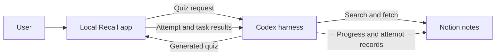

# Recall

Recall is a local agent harness for turning your Notion notes into interactive quizzes and tracking your learning over time.

Codex connects the Recall app with your Notion workspace through the Notion MCP server. It reads selected notes or learning modules, creates source-grounded quiz questions, sends them to the local Recall app, and keeps your roadmap progress and quiz history synchronized with Notion.

The browser only communicates with Recall. It never connects to Notion directly. Quiz generation is initiated through the Codex skills and protected internal endpoints rather than a browser-side generation control.

## What Recall does

- Generate quizzes from selected Notion pages, databases, concepts, or modules.
- Create questions across all relevant concepts instead of covering only headline topics.
- Support single-answer multiple choice and true/false questions.
- Support source-grounded flashcard sets with flip-card review, Known, and Review again actions.
- Randomize question and answer order.
- Balance correct-answer positions to avoid answer-position bias.
- Include explanations and source context for each question.
- Add problem-solving, logical-thinking, comparison, and practical-application questions.
- Run quizzes in Zen mode with a hidden timer.
- Show an exam warning before the quiz begins.
- Show a submission summary with score, duration, correct answers, and concept breakdown.
- Persist answers locally while a quiz is in progress.
- Track attempts, scores, retries, duration, and learning progress.
- Track quiz and flashcard attempts in one Notion table with a `Mode` property.
- Sync roadmap task status and quiz attempts back to Notion.
- Keep quiz-attempt data separate from learning-task data.
- Give created Notion pages, databases, rows, and other icon-capable artifacts a meaningful emoji/icon.

## Codex workflow



The Codex harness is responsible for the Notion operations:

1. Read the selected source through Notion MCP.
2. Generate and validate quiz questions.
3. Publish the quiz to Recall through the protected internal API.
4. Read completed-attempt sync requests.
5. Create or update the quiz-attempt record in Notion.
6. Update matching roadmap task progress.
7. Verify the Notion changes and mark the sync complete.

## Recall skills

The project includes reusable skills in `.agents/skills/`:

### `$recall-roadmap`

Creates a structured learning roadmap from a source. It can generate concept pages, learning tasks, table views, Kanban boards, schedules, and meaningful icons. It is designed to be idempotent and preserve existing notes and progress.

### `$recall-quiz`

Generates balanced quizzes from a roadmap, concept page, task database, or source note. It enforces exactly one correct answer per question, supports multiple choice and true/false, randomizes choices, balances answer positions, and validates source coverage and explanations.

When a specific concept is selected, it acts as a strict source boundary. A Fundamentals quiz uses only the Fundamentals note and its directly linked tasks unless the user explicitly requests more concepts.

### `$recall-track`

Synchronizes Recall activity with Notion. It updates roadmap task progress, creates one row per completed quiz or flashcard attempt, writes `Mode = Quiz` or `Mode = Flashcards`, prevents duplicate records, verifies table/Kanban changes, and repairs failed or queued syncs safely.

### `$recall-flashcards`

Generates source-grounded front/back flashcards from selected Notion notes or learning modules, publishes them to Recall through the protected internal API, and tracks each completed review as a separate Flashcards-mode attempt.

## Simple setup

From the Recall project folder:

```bash
cp .env.example .env
docker compose up --build
```

Then open:

```text
http://localhost:8080
```

Configure the required values in `.env`, including the agent key and the Notion MCP/workspace settings. Never commit real credentials.

To stop Recall:

```bash
docker compose down
```

The database volume is persistent, so your local quiz history remains available after restarting the containers.

## Notion organization

Recall keeps the learning system separated into two layers:

- A learning-task database for concepts, notes, ordering, and progress status.
- A quiz-attempt database for scores, retries, readable duration, correct answers, and completion history.

This allows the same Notion task database to power table and Kanban views without mixing quiz metrics into the learning roadmap.

Every completed quiz or flashcard attempt is stored as its own row in `Recall Quiz Attempts`, including retries. Each row keeps its own mode, score, date, duration, correct-answer count, retry number, status, and emoji/page icon, so the complete attempt history remains visible in Notion.

## Project locations

- Application: `/Users/decimozs/Personal/automations/recall`
- Skills: `/Users/decimozs/Personal/automations/recall/.agents/skills`
- Frontend: `/Users/decimozs/Personal/automations/recall/frontend`
- Backend: `/Users/decimozs/Personal/automations/recall/backend`
