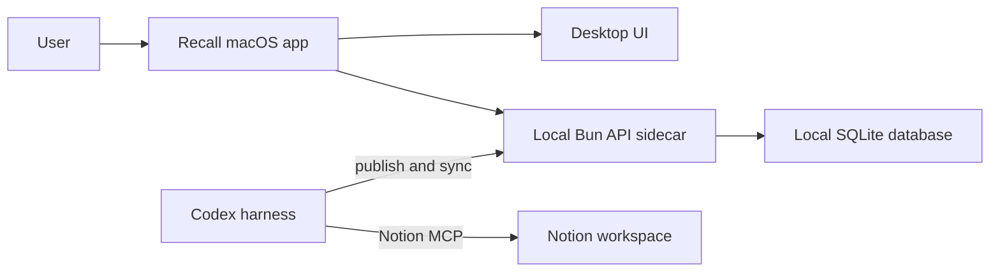

# Recall

Recall is a self-contained macOS learning desktop app for turning selected Notion notes into quizzes and flashcards, studying them offline, and tracking progress over time. Codex reads the selected Notion sources through the Notion MCP server, publishes study material to the local Recall app, and synchronizes completed attempts and roadmap progress back to Notion.

Recall is desktop-only for now. There is no browser runtime, Docker runtime, or PostgreSQL runtime in this project.

## Features

- Source-grounded quizzes with single-answer multiple choice and true/false questions.
- Randomized question and choice order with broad concept coverage and explanations.
- Source-grounded flashcard sets with front/back review and known or needs-review tracking.
- Zen mode for quizzes and flashcards with progress navigation, warning dialogs, submit confirmation, and summaries.
- Per-attempt score, answers, retries, duration, and recent activity tracking.
- Offline study for quizzes and flashcards already stored locally.
- Online Codex and Notion MCP generation and synchronization when connectivity is available.
- Local SQLite storage in the macOS application data directory.

## Codex skills

- `$recall-roadmap` creates structured learning areas, concept notes, learning tasks, views, and icons from a source.
- `$recall-quiz` generates validated quizzes with strict source boundaries, concept coverage, explanations, and randomized choices.
- `$recall-flashcards` generates and publishes source-grounded flashcard sets and tracks reviews.
- `$recall-track` synchronizes Recall attempts, task progress, and queued repairs with Notion.

## macOS setup

Apple signing and notarization are intentionally deferred. Local builds are unsigned.

From the project folder:

```bash
bun install --cwd desktop/ui
bun install --cwd desktop
bun install --cwd backend/migrate
bun run --cwd desktop build:sidecars
bun run --cwd desktop build
```

The unsigned DMG is produced at:

```text
desktop/src-tauri/target/release/bundle/dmg/
```

For local development:

```bash
bun run --cwd desktop dev
```

The packaged app starts its local API and SQLite adapter automatically. It stores the database and a protected `connection.json` manifest in the macOS application data directory. Codex uses that manifest for authenticated publish and synchronization calls.

### Agent runtime

Recall skills operate against the running desktop app rather than a separate web or Docker service:

- Local API: `http://127.0.0.1:3000`
- Connection manifest: `~/Library/Application Support/com.decimozs.recall/connection.json`
- Database source of truth: the app-managed SQLite database, accessed through the local API
- Authentication: the per-install `agent_key` from the connection manifest, sent as `X-Agent-Key`

Skills never edit the SQLite file directly. If the app or Notion is offline, saved quizzes and flashcards remain available for study; generation and Notion synchronization stay queued until connectivity returns.

## Preserving existing PostgreSQL data

`backend/migrate` is retained only as a one-time offline import utility. It copies workspaces, sources, quizzes, questions, attempts, answers, flashcards, review history, task results, sync requests, and queued generation requests into the local SQLite database while preserving IDs and timestamps.

Run a non-mutating check first:

```bash
DATABASE_URL=postgres://... \
bun run --cwd backend/migrate migrate --dry-run
```

Then import into the local SQLite database:

```bash
DATABASE_URL=postgres://... \
bun run --cwd backend/migrate migrate
```

The importer is upsert-based and does not delete local data by default. `--replace` requires the additional explicit environment variable `RECALL_ALLOW_REPLACE=1`.

## Architecture



Generation and Notion synchronization require an online Codex/Notion connection. Offline mode is intentionally read-only for generation: users can study saved quizzes and flashcards and retain local progress until connectivity returns.

## Project structure

- `desktop/` — Tauri macOS shell, packaging, development scripts, and desktop UI.
- `desktop/ui/` — Svelte UI bundled inside the desktop app.
- `backend/bun/` — local API sidecar used only by the desktop app.
- `backend/native/` — local SQLite adapter sidecar.
- `backend/migrate/` — optional one-time PostgreSQL-to-SQLite importer.
- `.agents/skills/` — project-local skill references.
- `/Users/decimozs/.agents/skills/` — globally installed Recall skills.

`/docs/` is intentionally ignored and is not part of the repository. Do not commit `.env`, credentials, database files, build artifacts, or sidecar binaries.
